<div align="center">

# 🚀 Ali Al-Kheder | Senior Software & AI Engineer

[](https://git.io/typing-svg)

[](https://aliportfolie.netlify.app/#home)
[](https://www.linkedin.com/in/ali-al-kheder)
[](mailto:alkhdyyr@gmail.com)

</div>

---

## 🎯 About Me

> **Passionate Senior Software & AI Engineer** with expertise in building scalable, intelligent applications that solve real-world problems. I specialize in full-stack development, AI/ML integration, and creating exceptional user experiences that drive business value.

```typescript
const ali = {
  role: "Senior Software & AI Engineer",
  location: "🌍 Global Remote",
  experience: "5+ years",
  specialties: [
    "Full-Stack Development",
    "AI/ML Integration",
    "System Architecture",
    "Performance Optimization",
  ],
  currentFocus: "Building intelligent, scalable web applications",
  motto: "Code with purpose, innovate with passion 🚀",
};
```

---

## 🛠️ Technical Arsenal

<div align="center">

### 💻 **Core Technologies**

<table>
<tr>
<td align="center" width="25%">

**Languages**
<br><br>


</td>
<td align="center" width="25%">

**Frontend**
<br><br>


</td>
<td align="center" width="25%">

**Backend**
<br><br>


</td>
<td align="center" width="25%">

**Database**
<br><br>


</td>
</tr>
</table>

### ☁️ **Cloud & DevOps**


### 🔧 **Development Tools**


</div>

---

## 🚀 Featured Projects

<div align="center">

<table>
<tr>
<td width="50%">

### 🛍️ **ShopHub E-Commerce Platform**

**Full-Stack E-Commerce Solution with AI Features**

[](https://shophub-demo.vercel.app)
[](https://github.com/al-kheder/ecommerce-shopHub)

**Tech Stack:** `JavaScript` `Firebase` `Vite` `TailwindCSS`

🎯 **Key Features:**

- 🔥 Real-time product management with Firebase
- 🛒 Advanced shopping cart with persistent storage
- 🔐 Secure user authentication system
- 📱 Fully responsive mobile-first design
- 🎨 Modern UI/UX with smooth animations
- 📊 SEO-optimized with structured data

**Impact:** Scalable e-commerce solution with modern architecture

</td>
<td width="50%">

### 🤖 **AI-Powered Project Suite**

**Machine Learning & Data Science Applications**

[](https://aliportfolie.netlify.app/#home)
[](https://github.com/al-kheder?tab=repositories)

**Tech Stack:** `Python` `TensorFlow` `FastAPI` `React`

🎯 **Key Innovations:**

- 🧠 AI/ML model integration and deployment
- 📈 Real-time data processing pipelines
- 🔬 Advanced analytics and visualization
- 🚀 High-performance API development
- 🎛️ Interactive dashboard interfaces
- 📊 Scalable cloud-native architecture

**Impact:** Intelligent solutions driving business automation

</td>
</tr>
</table>

</div>

---

## 📊 GitHub Analytics

<div align="center">


</div>

<div align="center">

[](https://git.io/streak-stats)

</div>

---

## 🌱 Continuous Learning & Growth

```mermaid
graph TD
    A[🎓 Current Focus] --> B[Master School Intensive Program]
    B --> C[🐍 Advanced Python Development]
    B --> D[⚡ Modern JavaScript Ecosystem]
    B --> E[🌐 Full-Stack Web Development]

    C --> F[🤖 AI/ML Integration]
    D --> G[⚛️ React/Next.js Mastery]
    E --> H[☁️ Cloud Architecture]

    F --> I[🚀 Production-Ready Solutions]
    G --> I
    H --> I

    style A fill:#2E9EF7,stroke:#fff,color:#fff
    style I fill:#00D4AA,stroke:#fff,color:#fff
```

<div align="center">



</div>

### 🎯 **Currently Mastering:**

- 🧠 **Advanced AI/ML Engineering** - Deep learning, neural networks, model optimization
- ⚡ **Modern JavaScript Architecture** - Micro-frontends, serverless, edge computing
- 🐍 **Python Excellence** - FastAPI, async programming, performance optimization
- ☁️ **Cloud-Native Development** - AWS services, containerization, DevOps practices
- 📊 **Data Engineering** - Real-time analytics, ETL pipelines, big data processing

---

## 🏆 Professional Highlights

<div align="center">

|  🎯 **Expertise Areas**  |  📈 **Impact Metrics**  | 🛠️ **Technical Skills**  |
| :----------------------: | :---------------------: | :----------------------: |
| Full-Stack Architecture  | 40+ Projects Delivered  | 5+ Programming Languages |
|    AI/ML Integration     |   99.9% System Uptime   | 15+ Frameworks Mastered  |
| Performance Optimization | 50% Load Time Reduction |  Cloud-Native Solutions  |
|     Team Leadership      | Cross-Functional Teams  |  Agile/DevOps Practices  |

</div>

---

## 🤝 Let's Build Something Amazing Together

<div align="center">

### 💡 **Open for Collaboration On:**

🚀 **AI-Powered Applications** • 🌐 **Scalable Web Platforms** • 🤖 **Machine Learning Projects** • 📊 **Data-Driven Solutions**

---

### 📬 **Get In Touch**

<table align="center">
<tr>
<td align="center">

[](https://aliportfolie.netlify.app/#home)

_Explore my complete project portfolio_

</td>
<td align="center">

[](https://www.linkedin.com/in/ali-al-kheder)

_Connect for opportunities & collaboration_

</td>
<td align="center">

[](mailto:alkhdyyr@gmail.com)

_Reach out for project discussions_

</td>
</tr>
</table>

---


**⭐ Feel free to explore my repositories and don't hesitate to reach out for collaboration opportunities!**

_"Innovation distinguishes between a leader and a follower." - Steve Jobs_

</div>
